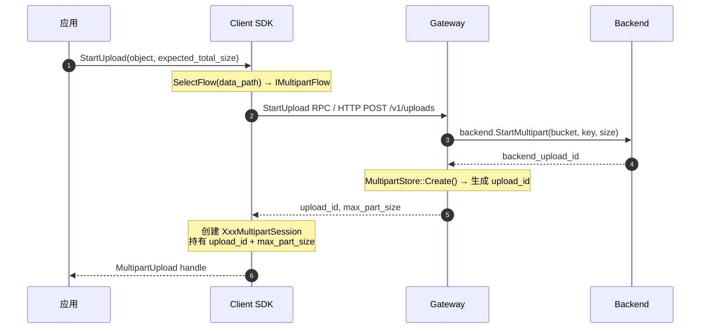
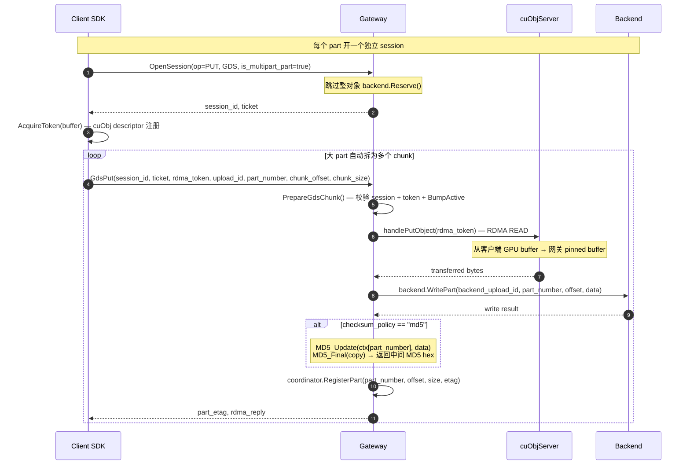
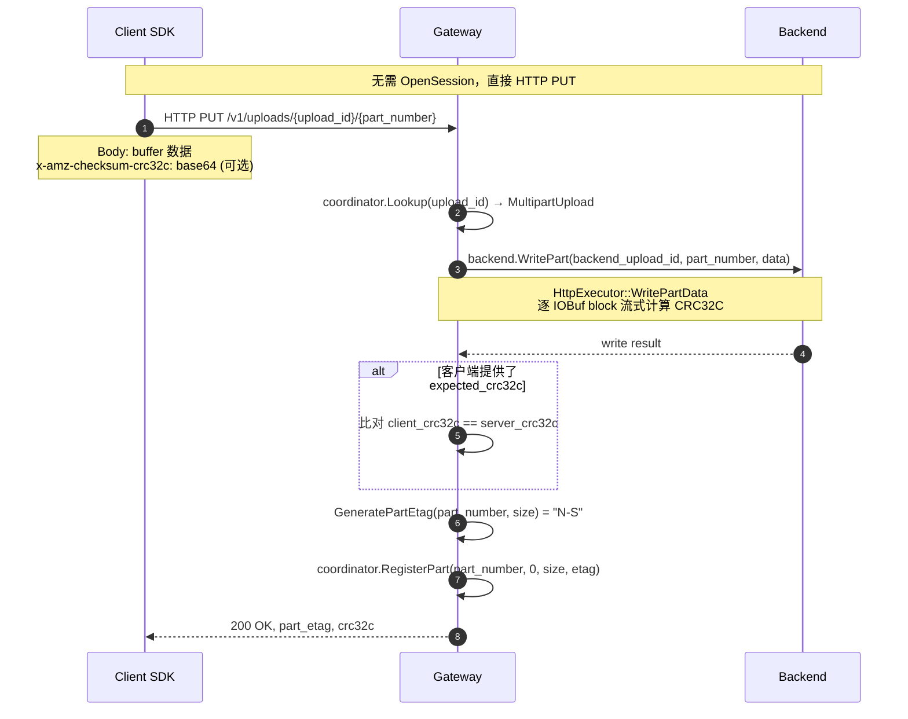
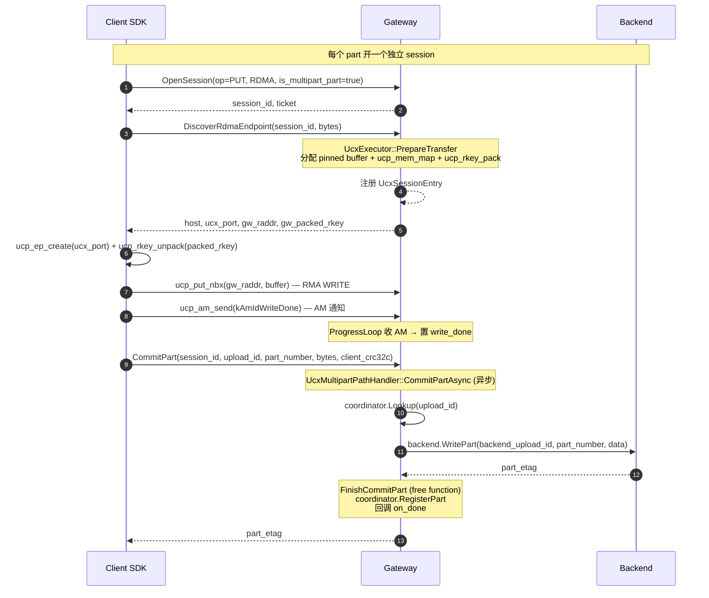
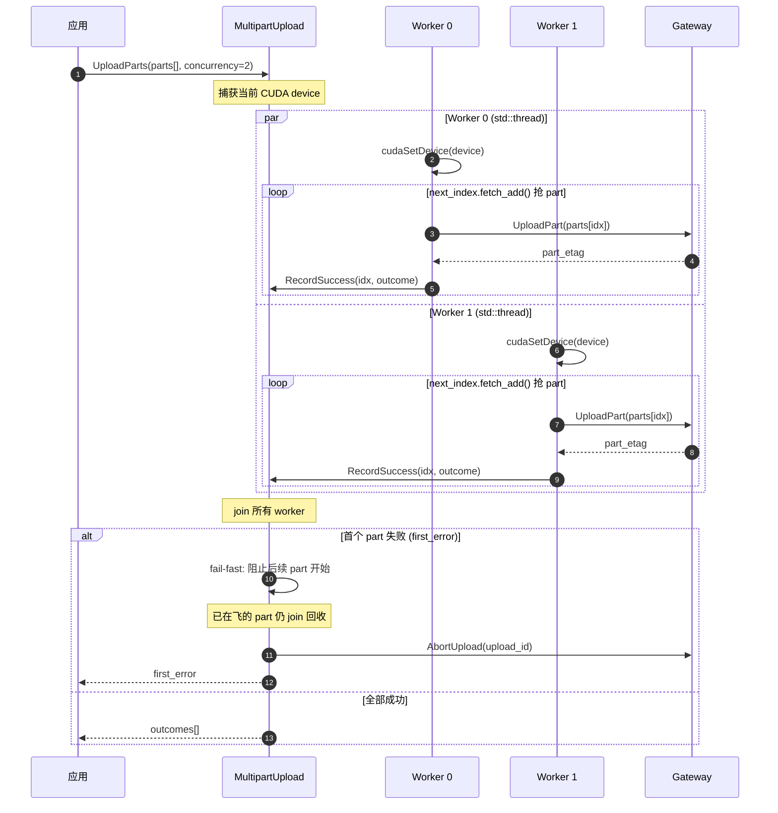
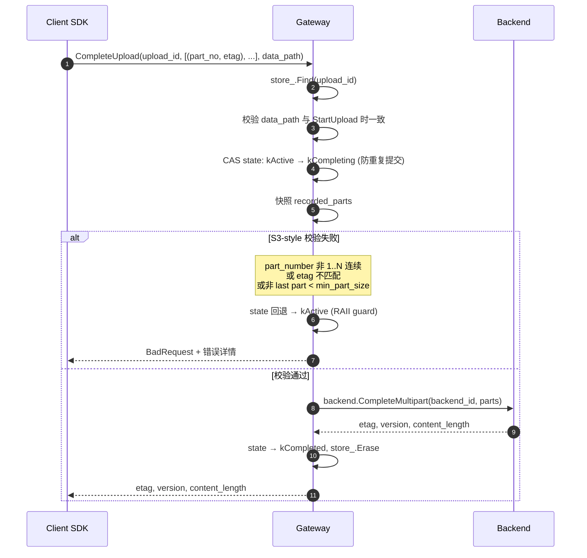
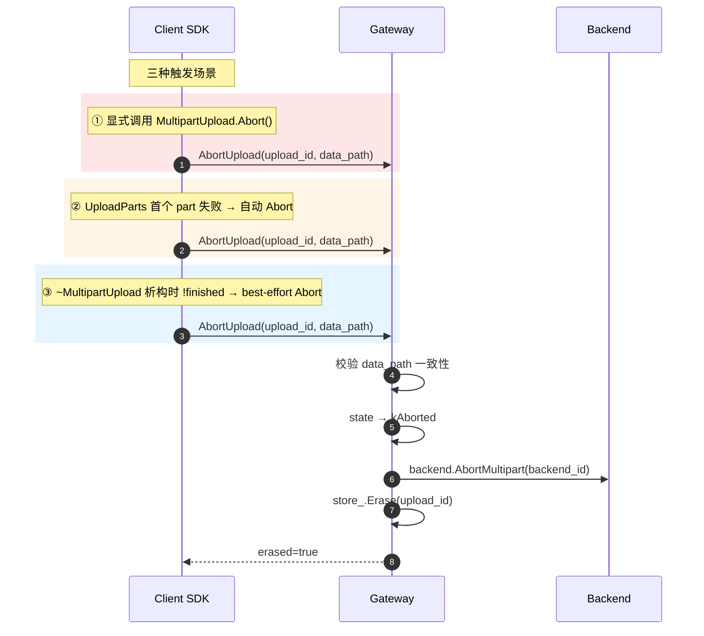
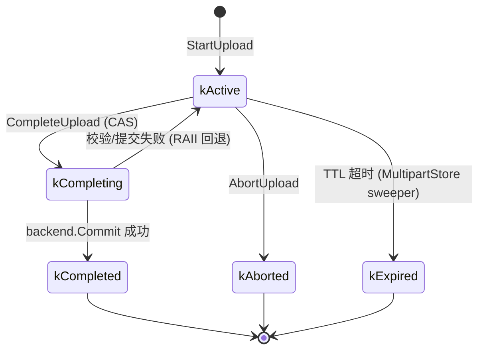

# Us3TurboAccess 项目文档

---

## 1. 综述

Us3TurboAccess 是一个面向 GPU 与 Native RDMA 的高性能对象存储接入层，并兼容传统 HTTP 通路。项目由客户端 SDK（`libus3_turbo_access_client`）与网关（`us3_turbo_access_gateway`）两部分对等组成：SDK 在应用侧封装传输协议与生命周期，网关负责协议适配、会话编排与后端落盘。数据面以 GPUDirect Storage（GDS/cuObject）和 Native RDMA（UCX RMA WRITE）两条零拷贝高速通路为核心，HTTP/1.1 作为兼容/兜底通路，三者运行时按 `DataPath` 枚举路由，提供整对象与分片上传的端到端传输能力。

**核心特性：**

- **多传输通路**：GDS（GPU 直达 RDMA）与 Native RDMA（UCX RMA WRITE）两条零拷贝高速通路为核心，HTTP/1.1 作为兼容通路，运行时按 `DataPath` 枚举路由
- **GPU 直传**：GDS 通路绕过 CPU 内存拷贝，cuObjServer 在网关侧完成 RDMA 操作，GPU buffer 直达后端存储
- **Native RDMA 零拷贝**：UCX 通路以 RMA WRITE + Active Message 通知实现 CPU 侧零拷贝传输，绕开内核协议栈
- **CRC32C 端到端校验**：PUT 时客户端计算校验和、服务端复算验证；GET 时服务端计算、客户端验证
- **分片上传**：SDK 与网关协同支持分片上传全生命周期；SDK 内建 MultipartUpload handle，支持串行 `UploadPart` 和并发 `UploadParts`（固定 worker + fetch-add 流水线模型），网关侧支持跨 chunk MD5 累积
- **会话生命周期管理**：网关侧 TTL 自动过期 + SessionSweeper 定时清扫，防止会话泄漏
- **线程安全**：Client 对象线程安全；MultipartUpload 单所有者语义

**技术栈：**

- C++20，CMake 3.24+
- brpc（baidu_std + HTTP 协议）
- Protobuf 25.4（静态链接）
- UCX 1.x（RDMA 通路）
- CUDA 12.x/13.x + cuObjServer（GDS 通路）
- OpenSSL / zlib / abseil（brpc 传递依赖）
- spdlog / nlohmann_json

---

## 2. 功能

### 2.1 客户端 SDK（libus3_turbo_access_client）

#### 对象操作

| API | 说明 |
|-----|------|
| `Initialize()` / `Shutdown()` | 初始化/关闭 SDK（幂等） |
| `HeadObject(ObjectId)` | 获取对象元数据（content_length, etag, version） |
| `GetObject(RequestOptions, MutableBufferView)` | 下载对象到指定 buffer |
| `PutObject(RequestOptions, ConstBufferView)` | 上传 buffer 内容为对象 |

#### 异步操作

| API | 说明 |
|-----|------|
| `HeadObjectAsync(...)` | 异步 Head，返回 `std::future` |
| `GetObjectAsync(...)` | 异步 GET |
| `PutObjectAsync(...)` | 异步 PUT |

异步操作通过 `ClientExecutor`（基于 brpc bthread）调度，与 brpc 网络栈共享调度器，避免独立线程池的 mutex 开销。

#### 分片上传

| API | 说明 |
|-----|------|
| `StartUpload(ObjectId, MultipartUpload*, ...)` | 发起分片上传会话 |
| `MultipartUpload::UploadPart(part_number, offset, buffer)` | 上传单个 part |
| `MultipartUpload::UploadParts(parts, concurrency)` | 并发上传多个 part |
| `MultipartUpload::Complete()` | 合并所有 part 为最终对象 |
| `MultipartUpload::Abort()` | 放弃上传，清理资源 |

`UploadParts` 采用固定 worker 数 + `next_index.fetch_add()` 流水线模型，非 batch 模式，worker 完成一个 part 立即抢下一个，无批次边界等待。

#### GPU Buffer 管理

| API | 说明 |
|-----|------|
| `RegisterDeviceBuffer(ptr, size)` | 预注册 GPU buffer 到 cuObj descriptor 表 |
| `UnregisterDeviceBuffer(ptr)` | 释放 descriptor（必须在 `cudaFree` 之前调用） |

#### 并发 GET

大对象自动分片并发下载，按 `parallel_get_threshold` 和 `parallel_get_chunks` 配置触发。GDS 通路额外对齐 4KB GPU page 以优化 cuFile DMA 性能。

### 2.2 网关（us3_turbo_access_gateway）

#### 控制面 RPC（baidu_std 协议）

| RPC | 说明 |
|-----|------|
| `OpenSession` | 创建传输会话，返回 session_id + ticket |
| `HeadObject` | 查询对象元数据 |
| `GdsGet` / `GdsPut` | GDS 通路 chunk 级读写 |
| `StartUpload` / `CompleteUpload` / `AbortUpload` | 分片上传生命周期 |
| `AbortSession` | 终止传输会话 |

#### UCX 数据面 RPC

| RPC | 说明 |
|-----|------|
| `DiscoverRdmaEndpoint` | 网关分配 RDMA buffer，返回地址 + rkey |
| `CommitObject` | RDMA 写入完成后落盘 |
| `CommitPart` | 分片 part 落盘 |
| `AbortSession` | 释放 RDMA buffer |

#### HTTP 入口

| 路由 | 方法 | 说明 |
|------|------|------|
| `/v1/objects/{bucket}/{key}` | GET / PUT / HEAD | 整对象操作 |
| `/v1/uploads/{bucket}/{key}` | POST | 发起分片上传 |
| `/v1/uploads/{upload_id}` | PUT / DELETE | 上传 part / 中止上传 |
| `/v1/uploads/{upload_id}/complete` | POST | 完成分片上传 |
| `/healthz` | GET | 健康检查 |
| `/vars` | GET | bvar 指标面板 |

---

## 3. 框架

### 3.1 整体架构

```
┌─────────────────────────────────────────────────────────────────┐
│                        Client SDK                               │
│  ┌──────────┐  ┌──────────────┐  ┌──────────────────────────┐  │
│  │  Client   │  │ MultipartUp- │  │    TransferRouter        │  │
│  │  (facade) │  │ load (handle)│  │  ┌─────┐ ┌─────┐ ┌────┐ │  │
│  └────┬─────┘  └──────┬───────┘  │  │ GDS │ │ HTTP│ │RDMA│ │  │
│       │               │           │  │Path │ │Path │ │Path│ │  │
│       │               │           │  └──┬──┘ └──┬──┘ └─┬──┘ │  │
│       └───────────────┼───────────────┼────────┼────────┤    │  │
│                       │               │        │        │    │  │
│              ClientExecutor(bthread)  │        │        │    │  │
└───────────────────────┼───────────────┼────────┼────────┼────┘
                        │               │        │        │
 ─ ─ ─ ─ ─ ─ ─ ─ ─ ─ ─╫─ ─ ─ ─ ─ ─ ─╫─ ─ ─ ─╫─ ─ ─ ─╫─ ─
           Network       │   baidu_std   │  HTTP  │  UCX   │
 ─ ─ ─ ─ ─ ─ ─ ─ ─ ─ ─╫─ ─ ─ ─ ─ ─ ─╫─ ─ ─ ─╫─ ─ ─ ─╫─ ─
                        │               │        │        │
┌───────────────────────┼───────────────┼────────┼────────┼────┐
│                  Gateway                               │    │
│  ┌────────────────────┼───────────────┼────────┼───────┤    │
│  │              API Layer              │        │       │    │
│  │  ControlPlaneService  HttpFrontend  │  RdmaDataPlane   │    │
│  └────────┬───────────┬───────────────┼────────┘       │    │
│           │           │               │                 │    │
│  ┌────────┼───────────┼───────────────┼─────────────────┤    │
│  │         Core Layer  │               │                 │    │
│  │  SessionAppService  │               │                 │    │
│  │  MetadataService    │               │                 │    │
│  │  SessionOpener      │               │                 │    │
│  │  MultipartAppService│               │                 │    │
│  └────────┬───────────┼───────────────┼─────────────────┘    │
│           │           │               │                      │
│  ┌────────┼───────────┼───────────────┼─────────────────┐    │
│  │       Data Path Layer               │                 │    │
│  │  GdsExecutor    HttpExecutor    UcxExecutor          │    │
│  │  GdsMultipart   HttpMultipart   UcxMultipart         │    │
│  └────────┬───────────┬───────────────┬─────────────────┘    │
│           │           │               │                      │
│  ┌────────┴───────────┴───────────────┴─────────────────┐    │
│  │                    Backend (IBackend)                  │    │
│  │           Memory / Null / Composite                   │    │
│  └───────────────────────────────────────────────────────┘    │
│                                                               │
│  ┌──────────────────┐  ┌──────────────────┐                   │
│  │  IoWorkerPool    │  │  SessionSweeper  │                   │
│  │  (N workers)     │  │  (periodic)      │                   │
│  └──────────────────┘  └──────────────────┘                   │
└───────────────────────────────────────────────────────────────┘
```

### 3.2 Client SDK 分层

```
client/
├── include/us3_turbo_access/client/   # 公共 API 头文件
│   ├── client.h                        # Client + MultipartUpload
│   ├── options.h                       # ClientOptions 及子配置
│   ├── result.h                        # Result<T> + Error
│   └── types.h                         # ObjectId, RequestOptions, BufferView, ...
├── src/
│   ├── core/                           # 核心逻辑
│   │   ├── client/                     # Client 实现 + MultipartUpload
│   │   ├── async/                      # ClientExecutor (bthread)
│   │   ├── common/                     # 错误、CRC、通道注册
│   │   ├── contracts/                  # 请求构建（MakeSessionHandshake 等）
│   │   ├── routing/                    # TransferRouter + TransferPath 基类
│   │   ├── gds/                        # GdsTransferPath（并行 GET 4KB 对齐）
│   │   ├── http/                       # HttpTransferPath + when_all
│   │   ├── rdma/                       # RdmaTransferPath（RAII WritePrepared）
│   │   ├── upload/                     # UploadCoordinator（按 DataPath 选 Flow）
│   │   └── metrics/                    # bvar 指标
│   ├── data/                           # 数据面客户端
│   │   ├── gds_data_client.h           # GdsChunk RPC 桩
│   │   ├── http_data_client.h          # HTTP PUT/GET/UploadPart
│   │   └── rdma_data_plane_client.h    # UCX Discover/Commit RPC 桩
│   ├── transports/                     # 传输层
│   │   ├── gds/                        # cuObjClient + GdsMemoryRegistry
│   │   ├── ucx/                        # UcxContext/Worker/Endpoint/EndpointPool
│   │   └── http/                       # brpc Channel 封装
│   └── control/                        # 控制面客户端
│       └── metadata_client.h           # OpenSession/HeadObject/Abort RPC 桩
```

### 3.3 Gateway 分层

```
gateway/
├── include/us3_turbo_access/gateway/  # 公共头文件
│   ├── options.h                       # GatewayOptions
│   ├── result.h                        # Result<T> + MakeError
│   └── types.h                         # 枚举 + 内部类型
├── src/
│   ├── api/                            # RPC/HTTP 协议适配层
│   │   ├── control_plane_service.h/cpp # baidu_std RPC handler
│   │   ├── http_frontend.h/cpp         # HTTP 路由 + handler
│   │   ├── rdma_data_plane_service.h/cpp # UCX 数据面 RPC
│   │   └── conversions.h/cpp           # proto/JSON → 领域对象转换
│   ├── core/                           # 核心业务逻辑
│   │   ├── session/                    # Session 生命周期
│   │   │   ├── session.h               # Session 结构体
│   │   │   ├── session_store.h/cpp     # 分片存储 + TTL
│   │   │   ├── session_app_service.h   # 会话操作门面
│   │   │   ├── session_opener.h/cpp    # OpenSession 流程
│   │   │   └── session_sweeper.h/cpp   # 定时清理
│   │   ├── multipart/                  # 分片上传管理
│   │   │   ├── multipart.h             # MultipartUpload 结构体
│   │   │   ├── multipart_store.h/cpp   # 分片存储 + TTL + MD5 累积
│   │   │   ├── multipart_coordinator.h  # 上传编排
│   │   │   └── multipart_app_service.h # RPC 适配
│   │   └── metadata/                  # 对象元数据
│   ├── data_path/                      # 数据通路执行器
│   │   ├── data_path_executor.h        # IDataPathExecutor 接口
│   │   ├── gds/                        # GDS 通路
│   │   │   ├── gds_executor.h/cpp      # cuObjServer + RDMA + CRC
│   │   │   ├── gds_multipart_path_handler.h/cpp # part 编排
│   │   │   └── buffer_pool.h/cpp       # PinnedBufferPool
│   │   ├── http/                       # HTTP 通路
│   │   │   ├── http_executor.h/cpp      # HTTP PUT/GET 流式
│   │   │   └── http_multipart_path_handler.h/cpp
│   │   └── ucx/                        # UCX RDMA 通路
│   │       ├── ucx_executor.h/cpp       # RMA WRITE + AM 通知
│   │       ├── ucx_multipart_path_handler.h/cpp
│   │       ├── ucx_session_registry.h/cpp # 会话状态管理
│   │       └── ucx_worker.h/cpp         # ProgressLoop 线程
│   ├── backend/                        # 后端存储抽象
│   │   ├── backend.h                   # IBackend 接口
│   │   ├── memory_backend.h/cpp        # 内存实现
│   │   └── null_backend.h/cpp          # 空实现
│   ├── runtime/                        # 运行时基础设施
│   │   ├── gateway_runtime.h/cpp       # 组件装配 + 生命周期
│   │   └── io_worker_pool.h/cpp        # 后台线程池
│   └── common/                         # 共享工具
│       ├── metrics.h/cpp               # bvar 指标定义
│       ├── error.h/cpp                 # 错误码 + ToHttpStatus
│       ├── ids.h/cpp                   # ID 生成（thread_local PRNG）
│       └── crc32c.h/cpp                # CRC32C 计算
└── proto/                              # Protobuf 定义
    ├── control_plane.proto             # 控制面服务
    ├── http_gateway.proto              # HTTP 网关
    └── rdma_data_plane.proto           # UCX 数据面
```

### 3.4 关键设计决策

| 决策 | 原因 |
|------|------|
| 控制面与数据面分离 | 控制面走 brpc baidu_std，数据面按通路特性独立（RDMA/HTTP/GDS） |
| IoWorkerPool 而非 bthread 执行 handler | cuObjServer RDMA 和 backend I/O 是阻塞调用，bthread 阻塞会占住 pthread 池 |
| Session ticket 机制 | 客户端在数据面 RPC 中回传 ticket，网关无状态校验 |
| 分片存储 Session/Multipart | 按 session_id/upload_id 哈希分到 32 个 shard，减少锁争用 |
| 线程局部 PRNG | `MakeRandomId` 使用 `thread_local std::mt19937_64`，避免全局锁 |
| UCX AM 通知替代 flush | 同 ep 上 AM 在 PUT 后发出保证按序到达，无需额外 flush |
| GDS 并行 GET 4KB 对齐 | cuFile DMA 对 GPU page 对齐访问性能更优 |

---

## 4. 交互时序：分片上传

分片上传（Multipart Upload）是 Us3TurboAccess 大对象传输的核心能力，由 **客户端 SDK** 与 **网关** 协同完成全生命周期管理。三条数据通路（GDS / HTTP / UCX）共享同一套控制面流程（StartUpload → UploadPart×N → Complete / Abort），但 **数据面的 per-part 传输机制**截然不同：

| 维度 | GDS 通路 | HTTP 通路 | UCX 通路 |
|------|----------|-----------|----------|
| **数据搬运** | cuObjServer RDMA READ（网关主动拉取 GPU buffer） | HTTP PUT body（客户端推送） | UCX RMA WRITE（客户端主动写入网关 buffer） |
| **per-part 会话** | OpenSession(is_multipart_part=true) + 多 GdsPut chunk | 无需 OpenSession，直接 HTTP PUT | OpenSession + DiscoverRdmaEndpoint |
| **校验** | 跨 chunk MD5 累积（checksum_policy=md5 时） | 流式 CRC32C | CRC32C（CommitPart 时比对） |
| **part etag** | 后端 etag 或跨 chunk MD5 hex | `"{part_number}-{size}"` 标准化格式 | 后端 etag |
| **并发友好** | 每个 chunk 独立 RDMA | 天然独立 | RMA WRITE + AM 信令天然并发 |
| **异步回调** | 否（同步 RPC） | 否（同步 HTTP） | 是（CommitPartAsync → FinishCommitPart） |

---

### 4.1 StartUpload（发起分片上传）



**说明：**

1. **ID 双层隔离**：`backend_upload_id` 由后端存储生成，仅网关内部使用；`upload_id` 由 `MultipartStore` 生成并暴露给客户端，避免后端句柄格式泄漏到 wire 协议。
2. **max_part_size 约束**：网关返回的 `max_part_size` 用于客户端侧校验——`UploadPart` 前即拒绝超大 part，避免无效 RDMA / HTTP 传输。
3. **通路入口差异**：GDS / UCX 走 `MetadataClient` 的 RPC（`RpcCreateMultipartUpload`），HTTP 走 `HttpDataClient::StartUpload`；三者最终汇入 `MultipartCoordinator::CreateUpload`。

---

### 4.2 UploadPart — GDS 通路（RDMA READ + 跨 chunk MD5）



**说明：**

1. **per-part OpenSession**：每个 part 独立开一个 GDS session，`is_multipart_part=true` 使网关跳过整对象的 `backend.Reserve()`。session 生命周期覆盖该 part 的全部 chunk。
2. **跨 chunk MD5 累积**：当 `checksum_policy="md5"` 时，网关在 `MultipartUpload::part_md5_ctxs` 中按 `part_number` 维护独立的 `MD5_CTX`。同一 part 的多个 chunk 通过 `MD5_Update` 累积；每次返回时 `MD5_Final` 仅作用于 CTX 的**副本**，原始 CTX 保留供后续 chunk 继续累积。最后一个 chunk 的 MD5 即为该 part 的最终 etag。
3. **ChunkDispatcher**：客户端 `PutObjectPart` 内部由 `ChunkDispatcher` 按网关 `put_single_max_bytes` 自动拆分大 part，对调用者透明。每个 chunk 是一次独立的 `GdsPut` RPC，共享同一个 session_id。
4. **rdma_token RAII**：`AcquireToken` 在函数返回时自动释放 cuObj descriptor，避免 GPU buffer 注销前 descriptor 泄漏。

---

### 4.3 UploadPart — HTTP 通路（流式 CRC32C）



**说明：**

1. **无需 OpenSession**：HTTP 通路的 part 上传不经过控制面 session，直接通过 HTTP PUT 将 body 推送到网关。这使 HTTP multipart 流程最简。
2. **标准化 etag**：`GeneratePartEtag` 生成 `"{part_number}-{size}"` 格式的 etag，所有数据通路在 `CompleteUpload` 时用此格式做 etag 交叉校验。HTTP 通路直接使用此标准化格式；GDS 通路使用后端 etag 或跨 chunk MD5（由 `checksum_policy` 决定）。
3. **流式 CRC32C**：`HttpExecutor::WritePartData` 逐 `butil::IOBuf` block 计算 CRC32C，避免额外内存拷贝。客户端可选在请求头中携带 `x-amz-checksum-crc32c`，网关会与之比对——不匹配则直接拒绝。

---

### 4.4 UploadPart — UCX 通路（RMA WRITE + AM + 异步回调）



**说明：**

1. **两阶段提交**：UCX 通路的数据传输与提交是解耦的。RMA WRITE 把数据搬到网关 pinned buffer，但此时网关并不知道数据就绪——客户端必须再发 AM 通知（`kAmIdWriteDone`）和 `CommitPart` RPC 触发落盘。这种"先写后提交"模式使 RMA WRITE 可以与后续操作流水化。
2. **AM 通知保证**：同一 endpoint 上 AM 在 RMA WRITE 之后发出，UCX 保证按序到达——因此 `CommitPart` 到达时 `write_done` 信号已就绪，无需额外 flush。
3. **异步回调链**：`CommitPartAsync` 不阻塞等待 backend 写入完成，而是注册回调 `FinishCommitPart`。这是一个 free function（不捕获 `this`），即使 handler 在回调触发前被销毁也安全。
4. **WritePrepared RAII**：客户端侧 `PrepareAndWrite` 返回 `WritePrepared`，析构时自动 `ReturnEp`——无论 CommitPart 成功或失败，RDMA endpoint slot 都会被正确回收。

---

### 4.5 UploadParts 并发上传模型



**说明：**

1. **流水线而非批次**：Worker 完成一个 part 后立即 `fetch_add` 抢下一个——无批次边界等待。这比"每批 N 个 part 再同步"的 batch 模型吞吐更高，因为快 worker 不会等待慢 worker。
2. **必须用 std::thread**：`UploadPart` 内部是阻塞调用（HTTP 等 TCP ACK、RDMA 等 RMA WRITE 完成、GDS 等 cuFile 返回）。若用 bthread 则阻塞会占住底层 pthread，N 个并发 worker 足以耗尽 brpc pthread pool，拖垮控制面 RPC 调度（实测 RDMA 吞吐从 ~18 GB/s 降至 ~640 MB/s）。
3. **fail-fast 语义**：首个 part 失败后，`HasError()` 使空闲 worker 不再开始新 part；已在飞的 part 不被中断，仍 join 等回收。join 后自动 `Abort()` 释放网关侧已上传 part。
4. **CUDA device 绑定**：每个 worker 入口 `cudaSetDevice` 绑定当前 GPU context。非 GDS 路径下该调用是 cheap no-op。

---

### 4.6 CompleteUpload（提交合并）



**说明：**

1. **data_path 校验**：`CompleteUpload` 必须走与 `StartUpload` 相同的数据通路，防止跨协议串扰（如 GDS 上传的 part 被 HTTP 通路 Complete）。
2. **CAS 防重复提交**：`state` 从 `kActive` CAS 到 `kCompleting` 抢占 owner，重复 Complete 被拒绝。校验或提交失败时 RAII guard 自动回退到 `kActive`，避免 upload 卡死。
3. **S3-style 校验**：part_number 必须 1..N 连续；客户端提供的 etag 必须与网关 `RegisterPart` 时记录的 etag 一致；除最后一个 part 外，其余必须 ≥ `min_part_size`。
4. **客户端侧兜底**：SDK 在 `Complete` 失败时 best-effort 调用 `Abort()`，释放网关侧已注册的 part 和后端存储资源。

---

### 4.7 AbortUpload（中止与析构兜底）



**说明：**

1. **析构兜底**：`~MultipartUpload()` 检查 `!finished`，若用户未显式 `Complete()` 或 `Abort()`，则 best-effort 调用 `Abort()`。这防止了异常退出时网关侧 part 资源泄漏。
2. **幂等安全**：对已完成的 upload 调用 `Abort()` 返回 `Success(true)`；对不存在的 upload_id 返回 `Success(false)`（no-op）。客户端无需担心重复中止。
3. **UploadParts 自动中止**：并发上传中任一 part 失败，join 后自动 `Abort()`，避免已上传 part 占用后端存储。

---

### 4.8 分片上传状态机



**说明：**

1. **kActive → kCompleting 是 CAS 原子操作**：防止两个并发 `CompleteUpload` 同时提交。只有第一个成功 CAS 的请求可以进入校验+提交流程。
2. **RAII 回退保证**：`StateRollbackGuard` 在校验或后端提交失败时自动将 `kCompleting` 回退为 `kActive`，确保 upload 不会因临时错误而卡死在中间状态。
3. **TTL 超时清扫**：`MultipartStore` 内置定时器，按 `last_activity_at + TTL` 判断过期。每次 `RegisterPart` 或 `Touch` 都会刷新 `last_activity_at`（加锁）。过期后自动转 `kExpired` 并从 store 移除。
4. **终态不可逆**：`kCompleted` / `kAborted` / `kExpired` 均为终态，进入后从 store 中 `Erase`，后续相同 upload_id 的操作返回 `kNotFound`。
